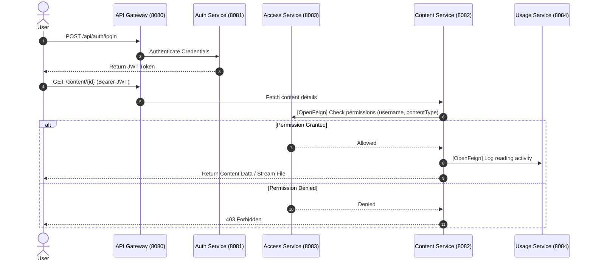

# ScholarSphere Digital — Microservices Architecture
> **PS029 : Digital Knowledge Platform & Content Access Management System**

ScholarSphere Digital is a distributed, service-oriented publishing and access control platform designed to deliver digital books, academic journals, and research documents to subscription-based users. The system isolates authentication, content cataloging, permission entitlement management, and usage metrics logging into independent microservices with JWT endpoint protection, Spring Cloud Gateway routing, and Netflix Eureka service discovery.

---

## 1. System Architecture Overview

### Architecture Diagram

```mermaid
flowchart TD
    Client(["Client (Browser / Mobile / Postman)"])

    subgraph ServiceRegistry ["Service Discovery & Registry"]
        Eureka["Eureka Server\n(Port: 8761)"]
    end

    subgraph EdgeRouting ["API Gateway Layer"]
        Gateway["Spring Cloud API Gateway\n(Port: 8080)\n• Dynamic Routing (lb://)\n• Load Balancing"]
    end

    subgraph Microservices ["Microservices Layer"]
        AuthSvc["Authentication Service\n(Port: 8081)\n• User Reg & Login\n• BCrypt & JWT Issuer"]
        ContentSvc["Content Service\n(Port: 8082)\n• Books, Journals, Research\n• File Storage & Catalog"]
        AccessSvc["Access Service\n(Port: 8083)\n• Subscription Plans\n• Access/Download Entitlements"]
        UsageSvc["Usage Service (Planned)\n(Port: 8084)\n• Reading History\n• Engagement & Metrics"]
    end

    subgraph Databases ["PostgreSQL Databases"]
        AuthDB[("SOA-AUTH\n(Port: 5432)")]
        ContentDB[("SOA-CONTENT\n(Port: 5432)")]
        AccessDB[("SOA-ACCESS\n(Port: 5432)")]
        UsageDB[("SOA-USAGE (Planned)\n(Port: 5432)")]
    end

    %% Client traffic
    Client -->|HTTP Requests| Gateway

    %% Discovery connections
    Gateway -.->|Registers & Discovers| Eureka
    AuthSvc -.->|Registers| Eureka
    ContentSvc -.->|Registers| Eureka
    AccessSvc -.->|Registers| Eureka
    UsageSvc -.->|Registers| Eureka

    %% Gateway routes
    Gateway -->|/api/auth/**| AuthSvc
    Gateway -->|/content/**| ContentSvc
    Gateway -->|/access/**| AccessSvc
    Gateway -.->|/usage/**| UsageSvc

    %% Inter-service communication via OpenFeign
    AccessSvc -.->|OpenFeign (Planned)| ContentSvc
    ContentSvc -.->|OpenFeign (Planned)| UsageSvc

    %% Database connections
    AuthSvc --> AuthDB
    ContentSvc --> ContentDB
    AccessSvc --> AccessDB
    UsageSvc -.-> UsageDB
```

---

## 2. Technology Stack & Infrastructure

| Component | Technology | Version / Configuration |
| :--- | :--- | :--- |
| **Java Platform** | OpenJDK | Java 21 |
| **Framework** | Spring Boot | 3.4.1 |
| **Microservices Suite** | Spring Cloud | 2024.0.0 |
| **Service Registry** | Spring Cloud Netflix Eureka Server | Standalone mode (`8761`) |
| **API Gateway** | Spring Cloud Gateway | Reactive Gateway with Spring Cloud LoadBalancer (`8080`) |
| **Security & Auth** | Spring Security 6 & JJWT | Stateless JWT (HMAC-SHA256, 15 min expiry) |
| **Persistence / ORM** | Spring Data JPA / Hibernate | DDL Auto: `update`, Dialect: PostgreSQL |
| **Database** | PostgreSQL | Port `5432`, Separate databases per service |
| **Inter-Service Calls** | Spring Cloud OpenFeign | Declared in architecture (Planned for Access & Content) |

---

## 3. Current State Inventory: What Is Built vs What Is Pending

### Summary Status Table

| Microservice / Component | Implementation Status | Port | Database | Key Responsibilities |
| :--- | :--- | :--- | :--- | :--- |
| **Eureka Server** | Completed | `8761` | N/A | Service registration & dynamic discovery |
| **API Gateway** | Configured (Needs Minor Fix) | `8080` | N/A | Central routing & load balancing |
| **Authentication Service** | Completed | `8081` | `SOA-AUTH` | User registration, login, password hashing, JWT generation |
| **Content Service** | Completed | `8082` | `SOA-CONTENT` | Content metadata CRUD & file upload storage |
| **Access Service** | Completed | `8083` | `SOA-ACCESS` | Subscription plan management & permission verification |
| **Usage Service** | Missing / Pending | `8084` | `SOA-USAGE` | Reading history, engagement tracking & metrics |
| **Gateway JWT Validation** | Pending | Gateway | N/A | Gateway-level token verification & request filtering |
| **Inter-Service Feign Clients** | Pending | Access / Content | N/A | Automated permission verification & activity logging |
| **Frontend Web App** | Pending | TBD | N/A | User portal for catalog browsing, reader, and plans |

---

## 4. Microservices Deep Dive

### 1. Eureka Server (`Backend/EurekaServer`)
- **Port**: `8761`
- **Application Name**: `EurekaServer`
- **Role**: Service registry enabling dynamic service discovery without hardcoding IP addresses or ports.
- **Config Highlights**:
  - `eureka.client.register-with-eureka=false`
  - `eureka.client.fetch-registry=false`

---

### 2. API Gateway (`Backend/ApiGateway`)
- **Port**: `8080`
- **Application Name**: `APIGATEWAY`
- **Role**: Single entry point for all incoming client traffic. Dispatches requests to registered services using Eureka service IDs (`lb://<SERVICE_NAME>`).
- **Configured Routes**:
  - `Path=/api/auth/**` $\rightarrow$ `lb://AUTHENTICATIONSERVICE`
  - `Path=/content/**` $\rightarrow$ `lb://CONTENT-SERVICE`
  - `Path=/access/**` $\rightarrow$ `lb://CONTENT-SERVICE` *(Note: Route target currently misconfigured, see Section 6)*

---

### 3. Authentication Service (`Backend/AuthenticationService`)
- **Port**: `8081`
- **Application Name**: `AUTHENTICATIONSERVICE`
- **Database**: PostgreSQL `SOA-AUTH`
- **Role**: Handles user credentials, password encryption, and stateless token creation.
- **Domain Model**:
  - **`User`**:
    - `id` (Long, PK)
    - `username` (String, Unique)
    - `email` (String, Unique)
    - `password` (String, BCrypt hashed)
    - `role` (`Role`: `USER`, `ADMIN`)
    - `enabled` (boolean)
    - `createdAt` (LocalDateTime)
- **Security Mechanism**:
  - Stateless session with `JwtAuthenticationFilter`.
  - Secret key HMAC-SHA256 with 900,000 ms (15 min) token expiration.
- **REST Endpoints**:
  | Method | Endpoint | Request Body | Description |
  | :--- | :--- | :--- | :--- |
  | `POST` | `/api/auth/register` | `SignUpRequest` (`username`, `email`, `password`, `role`) | Registers user with encrypted password |
  | `POST` | `/api/auth/login` | `LoginInRequest` (`username`, `password`) | Verifies credentials and returns JWT token string |

---

### 4. Content Service (`Backend/ContentService`)
- **Port**: `8082`
- **Application Name**: `CONTENT-SERVICE`
- **Database**: PostgreSQL `SOA-CONTENT`
- **Role**: Manages digital content metadata and physically stores uploaded files on the local filesystem (`uploads/`).
- **Domain Model**:
  - **`Content`**:
    - `id` (Long, PK)
    - `title` (String)
    - `author` (String)
    - `description` (String)
    - `type` (`ContentType`: `BOOK`, `JOURNAL`, `RESEARCH_DOCUMENT`)
    - `fileName` (String)
    - `filePath` (String)
    - `createdAt` (LocalDateTime)
- **REST Endpoints**:
  | Method | Endpoint | Payload / Params | Description |
  | :--- | :--- | :--- | :--- |
  | `POST` | `/content/upload` | Multipart (`content`: JSON `ContentRequest`, `file`: MultipartFile) | Stores file in `uploads/` and persists metadata |
  | `GET` | `/content` | None | Returns list of all cataloged contents |
  | `GET` | `/content/{id}` | `id` (Path variable) | Retrieves a specific content item by ID |
  | `DELETE` | `/content/{id}` | `id` (Path variable) | Deletes record from DB and deletes file from disk |

---

### 5. Access Service (`Backend/AccessService`)
- **Port**: `8083`
- **Application Name**: `ACCESS-SERVICE`
- **Database**: PostgreSQL `SOA-ACCESS`
- **Role**: Controls digital rights management (DRM), subscription plans, user subscriptions, and permission checks for viewing/downloading specific content types.
- **Domain Models**:
  - **`SubscriptionPlan`**:
    - `id` (Long, PK)
    - `planType` (`PlanType`: `FREE`, `BASIC`, `PREMIUM`)
    - `price` (double)
    - `canView` (boolean)
    - `canDownload` (boolean)
    - `canAccessBooks` (boolean)
    - `canAccessJournals` (boolean)
    - `canAccessResearch` (boolean)
  - **`UserSubscription`**:
    - `id` (Long, PK)
    - `username` (String)
    - `planType` (`PlanType`)
    - `startDate` (LocalDateTime)
    - `endDate` (LocalDateTime)
    - `active` (boolean)
- **REST Endpoints**:
  | Method | Endpoint | Payload / Params | Description |
  | :--- | :--- | :--- | :--- |
  | `POST` | `/access/plans` | `PlanRequest` | Creates a subscription tier configuration |
  | `POST` | `/access/subscribe` | `SubscriptionRequest` (`username`, `planType`) | Subscribes a user for 1 month |
  | `GET` | `/access/subscription/{username}` | `username` (Path variable) | Fetches user's current subscription status |
  | `GET` | `/access/view/{username}/{contentType}` | `username`, `contentType` | Validates if user can view the specific content type |
  | `GET` | `/access/download/{username}/{contentType}` | `username`, `contentType` | Validates if user can download the specific content type |

---

### 6. Usage Service (Required by PS029 — Pending Implementation)
- **Planned Port**: `8084`
- **Planned Application Name**: `USAGE-SERVICE`
- **Planned Database**: PostgreSQL `SOA-USAGE`
- **Role**: Tracks user engagement, logs reading sessions, counts downloads, and records access audit trails to detect scrapers or access breaches.
- **Target Domain Model**:
  - **`ReadingHistory` / `UsageLog`**:
    - `id` (Long, PK)
    - `username` (String)
    - `contentId` (Long)
    - `actionType` (`VIEW`, `DOWNLOAD`)
    - `timestamp` (LocalDateTime)
    - `durationSeconds` (Integer)
    - `ipAddress` (String)

---

## 5. Inter-Service Communication Flow



---

## 6. Discrepancies & Issues Identified in Existing Code

1. **API Gateway Route Target Bug**:
   - In `Backend/ApiGateway/src/main/resources/application.properties`:
     ```properties
     spring.cloud.gateway.routes[2].id=ACCESS-SERVICE
     spring.cloud.gateway.routes[2].uri=lb://CONTENT-SERVICE  # <-- BUG: Points to CONTENT-SERVICE
     spring.cloud.gateway.routes[2].predicates[0]=Path=/access/**
     ```
     **Fix Required**: Change `lb://CONTENT-SERVICE` to `lb://ACCESS-SERVICE`.

2. **AccessService Maven Artifact Misnaming**:
   - In `Backend/AccessService/pom.xml`:
     ```xml
     <artifactId>contentService</artifactId>
     <name>ContentService</name>
     ```
     **Fix Required**: Update to `access-service` / `AccessService`.

3. **Missing `UsageService`**:
   - Explicitly listed in Problem Statement `PS029` and `Architecture.rtf` but not yet created in `Backend/`.

4. **Missing OpenFeign Integration**:
   - Documented in architecture design, but `spring-cloud-starter-openfeign` is not yet added in `AccessService` or `ContentService` to enable service-to-service validation.

5. **Global Gateway Security Filter**:
   - The Gateway currently forwards requests without validating the JWT token or stripping/passing claims downstream.

---

## 7. Recommended Next Steps

1. **Fix Gateway Routing and POM naming**:
   - Point `/access/**` to `lb://ACCESS-SERVICE`.
   - Correct the artifact naming in `AccessService/pom.xml`.
2. **Implement the Missing `UsageService`**:
   - Create Spring Boot service on port `8084` with Eureka client, PostgreSQL database `SOA-USAGE`, entities for `ReadingHistory` and `UsageLog`, and tracking endpoints.
3. **Add OpenFeign Inter-Service Communication**:
   - Connect `ContentService` $\rightarrow$ `AccessService` to enforce permission verification before serving files.
   - Connect `ContentService` $\rightarrow$ `UsageService` to log view/download events.
4. **Implement Gateway Authentication Filter**:
   - Add a global filter on API Gateway to validate JWT tokens and protect secured routes.
5. **Frontend Application**:
   - Build a responsive user interface for login, viewing subscriptions, catalog browsing, reading, and downloading.
